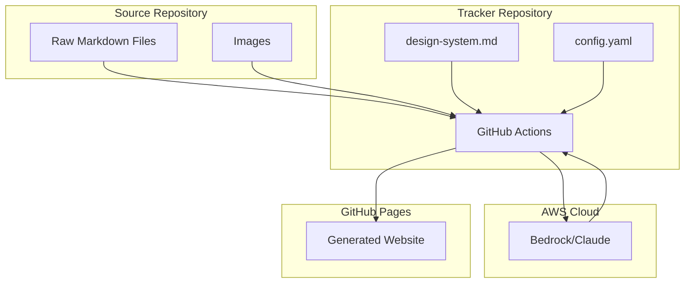

# Design Document: Automated Tracker (Simplified)

## Overview

The Automated Tracker is a GitHub Actions-based system that monitors a source repository and uses AI (AWS Bedrock/Claude) to generate a static website deployed to GitHub Pages.

**Key Simplification**: Instead of parsing markdown into structured data, we read raw files and let Claude interpret them directly. This eliminates complex extraction logic while leveraging Claude's natural language understanding.

## Architecture



## Simplified Pipeline

1. **Trigger**: GitHub webhook or manual dispatch
2. **Read**: Collect all markdown files and image paths from source repo
3. **Prompt**: Send raw content + design system to Claude
4. **Generate**: Claude produces complete HTML/CSS
5. **Deploy**: Write files to gh-pages branch

## Components

### 1. Content Reader (src/reader.js)

Simple file reader - no parsing, just reads raw content.

```javascript
// Returns { files: [{path, content}], images: [paths] }
async function readSourceContent(sourceDir) {
  // Read all .md files recursively
  // List all image files
  // Return raw content
}
```

### 2. AI Generator (src/generator.js)

Constructs prompt and calls Bedrock.

```javascript
async function generateSite(content, designSystem, config) {
  // Build prompt with all raw markdown
  // Call Claude via Bedrock
  // Parse response for HTML/CSS files
  // Return generated files
}
```

### 3. Deployer (src/deployer.js)

Writes output and handles git operations.

```javascript
async function deploy(generatedFiles, images, outputDir) {
  // Write HTML/CSS files
  // Copy images
  // Git commit to gh-pages
}
```

### 4. Design System (design-system.md)

Guidelines for Claude to follow when generating the site. Includes:
- Color palette and typography
- Component patterns (cards, progress bars, navigation)
- Page structure templates
- Example HTML snippets

### 5. Configuration (config.yaml)

```yaml
source:
  repository: "owner/backyard-drum-studio"
  branch: "main"

aws:
  region: "us-east-1"
  modelId: "anthropic.claude-3-sonnet-20240229-v1:0"

site:
  title: "Backyard Drum Studio"
  description: "DIY sound-isolated music studio build"

output:
  directory: "dist"
  branch: "gh-pages"
```

## Prompt Strategy

The prompt to Claude includes:
1. Design system document (styling guidelines)
2. All raw markdown files from source repo
3. List of available images
4. Instructions to generate a multi-page static site

Claude returns a JSON structure with all generated files:
```json
{
  "files": [
    { "path": "index.html", "content": "..." },
    { "path": "phases.html", "content": "..." },
    { "path": "styles.css", "content": "..." }
  ]
}
```

## Error Handling

| Error | Strategy |
|-------|----------|
| Bedrock API failure | Retry 3x with exponential backoff |
| Invalid AI response | Log and fail (don't deploy broken site) |
| Missing source files | Continue with available content |
| Deploy failure | Preserve previous deployment |

## What We Removed

The original design had:
- Complex markdown parsers for each file type
- Structured data models (MasterPlan, Task, GlossaryTerm, etc.)
- Property-based tests for extraction logic
- Completion percentage calculations

All of this is now handled by Claude interpreting the raw markdown directly.

## Testing Strategy

With the simplified approach, testing focuses on:
1. **Integration tests**: Mock Bedrock responses, verify file output
2. **Config validation**: Ensure config parsing works
3. **Manual verification**: Review generated sites

Property-based testing of extraction logic is no longer needed since we're not extracting structured data.
