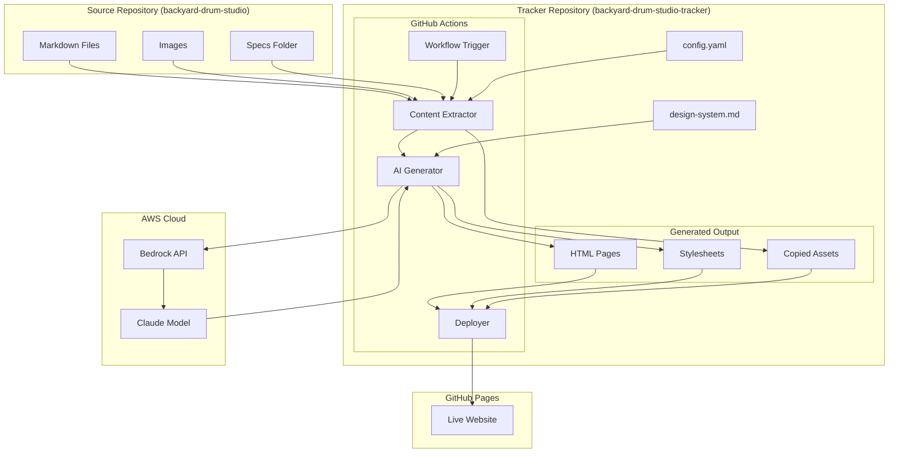

# Design Document: Automated Tracker

## Overview

The Automated Tracker is a GitHub Actions-based system that monitors a source repository containing DIY construction project documentation and automatically generates a static website using AI (AWS Bedrock/Claude). The generated website is deployed to GitHub Pages.

The system follows a pipeline architecture:
1. **Trigger**: GitHub webhook or repository_dispatch event from source repo commits
2. **Extract**: Clone source repo and parse markdown/image content
3. **Transform**: Use AWS Bedrock to generate HTML/CSS following a design system
4. **Deploy**: Push generated files to GitHub Pages

This design prioritizes simplicity, reliability, and iterability on the website design through a configurable design system document.

## Architecture



### Key Design Decisions

1. **Single Workflow File**: All logic in one GitHub Actions workflow for simplicity
2. **Node.js Runtime**: Use Node.js for the generator script (good AWS SDK support, JSON handling)
3. **OIDC Authentication**: Keyless AWS auth via GitHub's OIDC provider
4. **Design System as Prompt Context**: Include design guidelines in AI prompts for consistency
5. **Atomic Deployment**: Generate all pages before deploying to avoid partial updates

## Components and Interfaces

### 1. GitHub Actions Workflow

**File**: `.github/workflows/generate-site.yml`

**Responsibilities**:
- Listen for repository_dispatch events from source repo
- Support manual workflow_dispatch for testing
- Orchestrate the extract → generate → deploy pipeline
- Handle AWS OIDC authentication
- Report success/failure status

**Trigger Configuration**:
```yaml
on:
  repository_dispatch:
    types: [source-updated]
  workflow_dispatch:
    inputs:
      source_ref:
        description: 'Source repo ref to build from'
        default: 'main'
```

### 2. Content Extractor Module

**File**: `src/extractor.js`

**Interface**:
```typescript
interface ExtractedContent {
  masterPlan: MasterPlan;
  changelog: ChangelogEntry[];
  phases: Phase[];
  glossary: GlossaryTerm[];
  images: ImageAsset[];
  metadata: ProjectMetadata;
}

interface MasterPlan {
  phases: PhaseStatus[];
  notes: string;
}

interface PhaseStatus {
  number: number;
  name: string;
  status: 'not-started' | 'in-progress' | 'complete';
  tasks?: TaskSummary;
}

interface Phase {
  id: string;
  name: string;
  requirements: Requirement[];
  design: string;
  tasks: Task[];
}

interface Task {
  id: string;
  text: string;
  status: 'pending' | 'in-progress' | 'complete';
  subtasks?: Task[];
  requirements?: string[];
  completedDate?: string;
  notes?: string;
}

interface ChangelogEntry {
  date: string;
  phase: string;
  items: ChangelogItem[];
}

interface GlossaryTerm {
  term: string;
  category: string;
  definition: string;
}

interface ImageAsset {
  path: string;
  phase?: string;
  description?: string;
}

// Main function
async function extractContent(sourceDir: string): Promise<ExtractedContent>
```

**Responsibilities**:
- Parse master-plan.md to extract phase list and status
- Parse CHANGELOG.md to extract recent updates
- Iterate specs/*/ directories to extract requirements, design, and tasks
- Parse glossary.md to extract terms by category
- Scan images/ directory for assets
- Calculate task completion percentages

### 3. AI Generator Module

**File**: `src/generator.js`

**Interface**:
```typescript
interface GeneratorConfig {
  awsRegion: string;
  modelId: string;
  designSystem: string;
}

interface GeneratedSite {
  pages: GeneratedPage[];
  styles: string;
}

interface GeneratedPage {
  filename: string;
  title: string;
  html: string;
}

// Main function
async function generateSite(
  content: ExtractedContent,
  config: GeneratorConfig
): Promise<GeneratedSite>
```

**Responsibilities**:
- Load design system document
- Construct prompts for each page type
- Call AWS Bedrock API with Claude model
- Parse AI responses to extract HTML/CSS
- Validate generated HTML structure
- Retry on transient failures

**Page Generation Strategy**:
1. Generate shared CSS first (one AI call)
2. Generate each page with CSS context (parallel AI calls)
3. Validate all outputs before returning

### 4. Deployer Module

**File**: `src/deployer.js`

**Interface**:
```typescript
interface DeployConfig {
  outputDir: string;
  branch: string;
}

async function deploy(
  site: GeneratedSite,
  assets: ImageAsset[],
  config: DeployConfig
): Promise<void>
```

**Responsibilities**:
- Write generated HTML/CSS to output directory
- Copy image assets to output directory
- Commit changes to gh-pages branch
- Push to trigger GitHub Pages deployment

### 5. Design System Document

**File**: `design-system.md`

**Purpose**: Provides consistent styling guidelines for AI generation

**Structure**:
```markdown
# Design System

## Brand
- Project name, tagline, personality

## Colors
- Primary, secondary, accent colors with hex values
- Semantic colors (success, warning, error)

## Typography
- Font families, sizes, weights
- Heading hierarchy

## Spacing
- Base unit, scale

## Components
- Navigation pattern
- Card styles
- Progress indicators
- Status badges
- Footer

## Page Templates
- Home page structure
- Phases page structure
- Progress page structure
- Glossary page structure

## Code Examples
- Example HTML snippets for each component
```

### 6. Configuration

**File**: `config.yaml`

```yaml
source:
  repository: "owner/backyard-drum-studio"
  branch: "main"

aws:
  region: "us-east-1"
  modelId: "anthropic.claude-3-sonnet-20240229-v1:0"

site:
  title: "Backyard Drum Studio"
  description: "DIY sound-isolated music studio build"
  
pages:
  home: true
  phases: true
  progress: true
  glossary: true

output:
  directory: "dist"
  branch: "gh-pages"
```

## Data Models

### Content Models

```typescript
// Represents the full extracted content from source repo
interface ExtractedContent {
  masterPlan: MasterPlan;
  changelog: ChangelogEntry[];
  phases: Phase[];
  glossary: GlossaryTerm[];
  images: ImageAsset[];
  metadata: ProjectMetadata;
}

// Project metadata derived from various sources
interface ProjectMetadata {
  name: string;
  location: string;
  currentPhase: string;
  overallProgress: number; // 0-100 percentage
  lastUpdated: string; // ISO date
}

// Master plan with phase overview
interface MasterPlan {
  phases: PhaseStatus[];
  notes: string;
}

interface PhaseStatus {
  number: number;
  name: string;
  status: 'not-started' | 'in-progress' | 'complete';
  taskCount?: number;
  completedTaskCount?: number;
}

// Detailed phase information from specs folder
interface Phase {
  id: string; // e.g., "01-planning-permits"
  number: number;
  name: string;
  requirements: Requirement[];
  designSummary: string;
  tasks: Task[];
  completionPercentage: number;
}

interface Requirement {
  id: string;
  title: string;
  description: string;
  acceptanceCriteria: string[];
}

// Task with nested subtasks
interface Task {
  id: string; // e.g., "1.2.1"
  text: string;
  status: 'pending' | 'in-progress' | 'complete';
  subtasks: Task[];
  requirementRefs: string[];
  completedDate?: string;
  startedDate?: string;
  notes?: string;
}

// Changelog entry grouped by date
interface ChangelogEntry {
  date: string;
  phase: string;
  items: ChangelogItem[];
}

interface ChangelogItem {
  type: 'completed' | 'started' | 'note';
  taskRef?: string;
  description: string;
}

// Glossary term with category
interface GlossaryTerm {
  term: string;
  category: string;
  definition: string;
}

// Image asset reference
interface ImageAsset {
  sourcePath: string;
  outputPath: string;
  phase?: string;
  altText?: string;
}
```

### Configuration Models

```typescript
interface TrackerConfig {
  source: SourceConfig;
  aws: AwsConfig;
  site: SiteConfig;
  pages: PagesConfig;
  output: OutputConfig;
}

interface SourceConfig {
  repository: string; // "owner/repo" format
  branch: string;
}

interface AwsConfig {
  region: string;
  modelId: string;
}

interface SiteConfig {
  title: string;
  description: string;
}

interface PagesConfig {
  home: boolean;
  phases: boolean;
  progress: boolean;
  glossary: boolean;
}

interface OutputConfig {
  directory: string;
  branch: string;
}
```

### Generation Models

```typescript
// Result of AI generation
interface GeneratedSite {
  pages: GeneratedPage[];
  styles: string; // Combined CSS
  generatedAt: string; // ISO timestamp
}

interface GeneratedPage {
  filename: string; // e.g., "index.html"
  title: string;
  html: string;
  pageType: 'home' | 'phases' | 'progress' | 'glossary';
}

// AI prompt structure
interface GenerationPrompt {
  systemPrompt: string;
  designSystem: string;
  contentContext: string;
  pageInstructions: string;
}
```


## Correctness Properties

*A property is a characteristic or behavior that should hold true across all valid executions of a system—essentially, a formal statement about what the system should do. Properties serve as the bridge between human-readable specifications and machine-verifiable correctness guarantees.*

### Content Extraction Properties

**Property 1: Master plan extraction preserves phases**
*For any* valid master-plan.md content containing N phases with statuses, extracting the content SHALL produce a MasterPlan object with exactly N PhaseStatus entries, each with the correct name and status.
**Validates: Requirements 2.1**

**Property 2: Changelog extraction preserves entries**
*For any* valid CHANGELOG.md content containing changelog entries, extracting the content SHALL produce ChangelogEntry objects that contain all the original dates, phases, and item descriptions.
**Validates: Requirements 2.2**

**Property 3: Task extraction preserves status**
*For any* valid tasks.md content with checkboxes in various states ([ ], [-], [x]), extracting the content SHALL produce Task objects where the status field correctly reflects the checkbox state (pending, in-progress, complete).
**Validates: Requirements 2.3**

**Property 4: Glossary extraction preserves terms**
*For any* valid glossary.md content containing terms organized by category, extracting the content SHALL produce GlossaryTerm objects that contain all original terms with their correct categories and definitions.
**Validates: Requirements 2.4**

**Property 5: Image discovery is complete**
*For any* directory structure containing image files in images/, extracting content SHALL produce ImageAsset objects for every image file present.
**Validates: Requirements 2.6**

**Property 6: Completion percentage calculation is accurate**
*For any* list of tasks with known completed/total counts, the calculated completion percentage SHALL equal (completed / total) * 100, rounded to the nearest integer.
**Validates: Requirements 2.7**

### Generation Properties

**Property 7: Generated home page contains project metadata**
*For any* ExtractedContent with project metadata, the generated home page HTML SHALL contain the project name, current phase, and overall progress percentage.
**Validates: Requirements 3.2**

**Property 8: Generated phases page contains all phases**
*For any* ExtractedContent with N phases, the generated phases page HTML SHALL contain all N phase names and their completion status.
**Validates: Requirements 3.3**

**Property 9: Generated progress page contains changelog entries**
*For any* ExtractedContent with changelog entries, the generated progress page HTML SHALL contain all entry dates and descriptions.
**Validates: Requirements 3.4**

**Property 10: Generated glossary page contains all terms**
*For any* ExtractedContent with glossary terms, the generated glossary page HTML SHALL contain all term names and definitions.
**Validates: Requirements 3.5**

**Property 11: Generated HTML is valid**
*For any* generated HTML output, the content SHALL pass HTML5 validation (well-formed tags, proper nesting, required attributes).
**Validates: Requirements 3.7**

### Configuration Properties

**Property 12: Prompt includes design system**
*For any* generation request, the constructed prompt SHALL contain the full design system document content.
**Validates: Requirements 4.3**

**Property 13: Bedrock client uses configured model**
*For any* TrackerConfig with a specified modelId, the Bedrock API calls SHALL use that exact model identifier.
**Validates: Requirements 7.4**

**Property 14: Valid config parsing round-trip**
*For any* valid TrackerConfig object, serializing to YAML and parsing back SHALL produce an equivalent TrackerConfig object.
**Validates: Requirements 8.1**

**Property 15: Invalid config produces descriptive error**
*For any* invalid configuration input (missing required fields, wrong types), parsing SHALL throw an error with a message that identifies the specific validation failure.
**Validates: Requirements 8.5**

### Error Handling Properties

**Property 16: Retry logic respects max attempts**
*For any* API call that fails repeatedly, the retry mechanism SHALL attempt exactly 3 retries before failing, with exponentially increasing delays between attempts.
**Validates: Requirements 6.1**

**Property 17: Partial extraction continues on file errors**
*For any* source directory where some files are valid and some are corrupted/missing, extraction SHALL return valid content for the good files and log errors for the bad files.
**Validates: Requirements 6.2**

**Property 18: HTML validator rejects malformed content**
*For any* malformed HTML input (unclosed tags, invalid nesting), the validator SHALL return false or throw a validation error.
**Validates: Requirements 6.3**

## Error Handling

### Extraction Errors

| Error Type | Handling Strategy |
|------------|-------------------|
| File not found | Log warning, continue with available files |
| Parse error (invalid markdown) | Log error with file path and line number, skip file |
| Permission denied | Log error, fail extraction for that file |
| Empty file | Treat as valid but empty content |

### AI Generation Errors

| Error Type | Handling Strategy |
|------------|-------------------|
| Bedrock API timeout | Retry with exponential backoff (1s, 2s, 4s) |
| Rate limit exceeded | Retry after delay specified in response header |
| Invalid response format | Log response, retry once, then fail |
| Model not available | Fail with descriptive error, suggest checking config |

### Deployment Errors

| Error Type | Handling Strategy |
|------------|-------------------|
| Git push failed | Retry once, then fail workflow |
| Branch protection | Fail with message about branch settings |
| Disk space | Fail with cleanup suggestion |

### Error Response Format

```typescript
interface TrackerError {
  code: string;          // e.g., "EXTRACTION_PARSE_ERROR"
  message: string;       // Human-readable description
  file?: string;         // Affected file path
  line?: number;         // Line number if applicable
  recoverable: boolean;  // Whether processing can continue
  suggestion?: string;   // Suggested fix
}
```

## Testing Strategy

### Dual Testing Approach

This project uses both unit tests and property-based tests:

- **Unit tests**: Verify specific examples, edge cases, and integration points
- **Property tests**: Verify universal properties across randomly generated inputs

Both are complementary and necessary for comprehensive coverage.

### Property-Based Testing Configuration

- **Library**: fast-check (JavaScript property-based testing library)
- **Minimum iterations**: 100 per property test
- **Tag format**: `Feature: automated-tracker, Property {number}: {property_text}`

### Test Organization

```
tests/
├── unit/
│   ├── extractor.test.js      # Unit tests for content extraction
│   ├── generator.test.js      # Unit tests for AI generation (mocked)
│   ├── validator.test.js      # Unit tests for HTML validation
│   └── config.test.js         # Unit tests for config loading
├── property/
│   ├── extractor.property.js  # Property tests for extraction
│   ├── generator.property.js  # Property tests for generation
│   ├── config.property.js     # Property tests for config
│   └── generators/            # Custom data generators
│       ├── markdown.js        # Generate random markdown content
│       ├── tasks.js           # Generate random task structures
│       └── config.js          # Generate random configs
└── integration/
    └── workflow.test.js       # End-to-end workflow tests (mocked AWS)
```

### Property Test Implementation

Each correctness property maps to a single property-based test:

```javascript
// Example: Property 6 - Completion percentage calculation
// Feature: automated-tracker, Property 6: Completion percentage calculation is accurate
test.prop([fc.array(fc.record({
  status: fc.constantFrom('pending', 'in-progress', 'complete')
}), { minLength: 1 })])(
  'completion percentage equals completed/total * 100',
  (tasks) => {
    const completed = tasks.filter(t => t.status === 'complete').length;
    const expected = Math.round((completed / tasks.length) * 100);
    const actual = calculateCompletionPercentage(tasks);
    expect(actual).toBe(expected);
  }
);
```

### Unit Test Focus Areas

- **Edge cases**: Empty files, single items, maximum sizes
- **Error conditions**: Invalid input, missing files, malformed content
- **Integration points**: AWS SDK mocking, file system operations
- **Specific examples**: Known markdown patterns from source repo

### Test Data Generators

Custom generators for property tests:

```javascript
// Generate random valid master-plan.md content
const masterPlanArb = fc.record({
  phases: fc.array(fc.record({
    number: fc.integer({ min: 0, max: 20 }),
    name: fc.string({ minLength: 1, maxLength: 50 }),
    status: fc.constantFrom('not-started', 'in-progress', 'complete')
  }), { minLength: 1, maxLength: 15 })
});

// Generate random valid task checkbox markdown
const taskCheckboxArb = fc.oneof(
  fc.constant('[ ]'),   // pending
  fc.constant('[-]'),   // in-progress
  fc.constant('[x]')    // complete
);
```

### Mocking Strategy

- **AWS Bedrock**: Mock SDK responses for deterministic testing
- **File System**: Use in-memory file system (memfs) for isolation
- **GitHub API**: Mock for deployment tests

### CI Integration

```yaml
# In GitHub Actions workflow
- name: Run tests
  run: |
    npm test -- --coverage
    npm run test:property -- --numRuns=100
```
